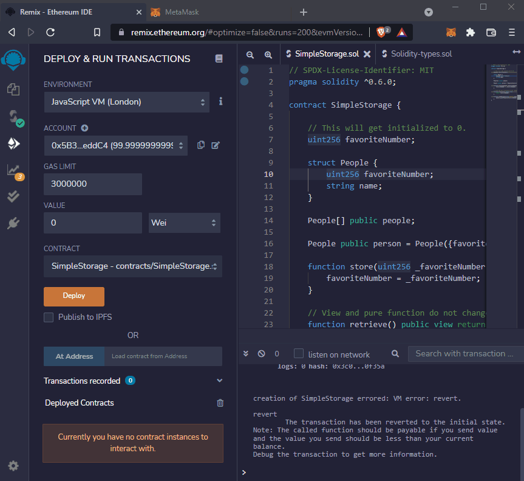

# DAPP development with Solidity

Solidity Language Reference

Solidity is an object-oriented, high-level language for implementing smart contracts. Smart contracts are programs which govern the behaviour of accounts within the Ethereum state.

Solidity is statically typed, supports inheritance, libraries and complex user-defined types among other features.

With Solidity you can create contracts for uses such as voting, crowdfunding, blind auctions, and multi-signature wallets.

https://docs.soliditylang.org/en/v0.8.10/



## My Wallet Address

```
0x64dfec81c2230d99Fa63A254915bB70a7F91d6D0
```

[Balance](https://etherscan.io/address/0x64dfec81c2230d99Fa63A254915bB70a7F91d6D0) 💰